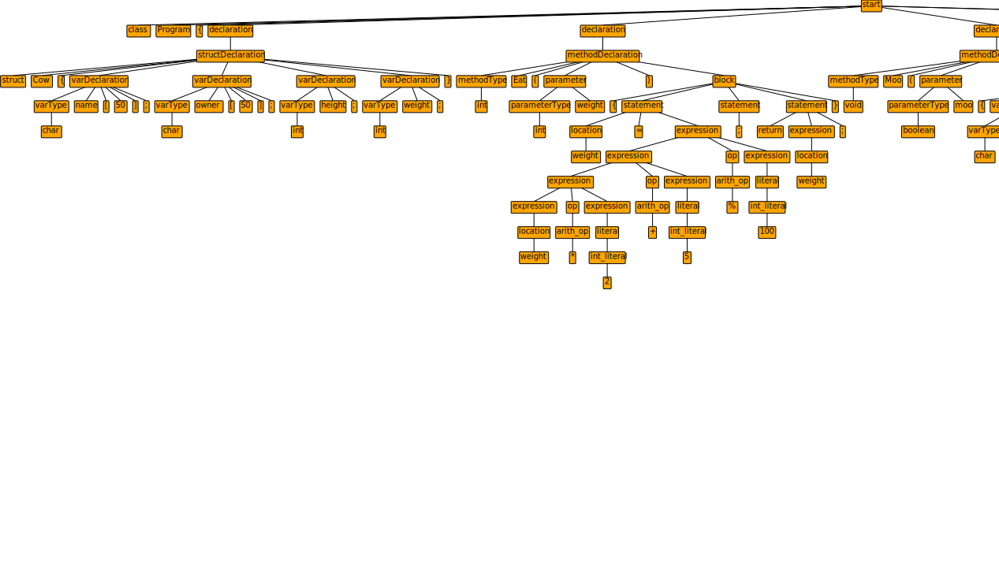
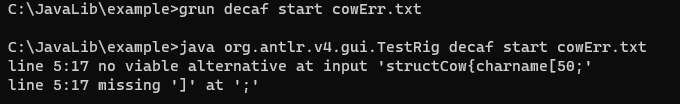
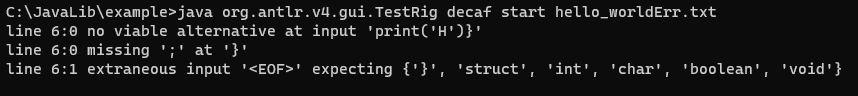

# ANTLR con Python3

## Instalación
Para la instalación de ANTLR recomiendo seguir el siguiente vídeo: [ANTLR Set up for Loading Parse Tree | Windows | English Tutorial](https://www.youtube.com/watch?v=p2gIBPz69DM)


Para Descargar la librería correspondiente en Python3
```
pip3 install antlr4-python3-runtime
```

## Comandos Útiles
Ejecución Java
```
class
antlr <nombreGramatica>.g4
javac <nombreGramatica>*.java 
grun <nombreGramatica> <reglaInicial> <programaFuente>.txt
grun <nombreGramatica> <reglaInicial> <programaFuente>.txt -gui
```

Ejecución Python3
```
class
antlr -Dlanguage=Python3 <nombreGramatica>.g4
Python3 Main.py
```
## Pruebas 

### cow
Programa con un poquito de todas las reglas, desde declaración de estructuras hasta métodos y condiciones
#### Programa sin ningún error
[Código Fuente](./decafPrograms/cow.txt)


#### Programa con errores
[Código Fuente](./decafPrograms/cowErr.txt)


### hello_world
Programa simple, solo se imprime una H
#### Programa sin ningún error
[Código Fuente](./decafPrograms/hello_world.txt)


### hello_worldErr
#### Programa con errores
[Código Fuente](./decafPrograms/hello_worldErr.txt)

